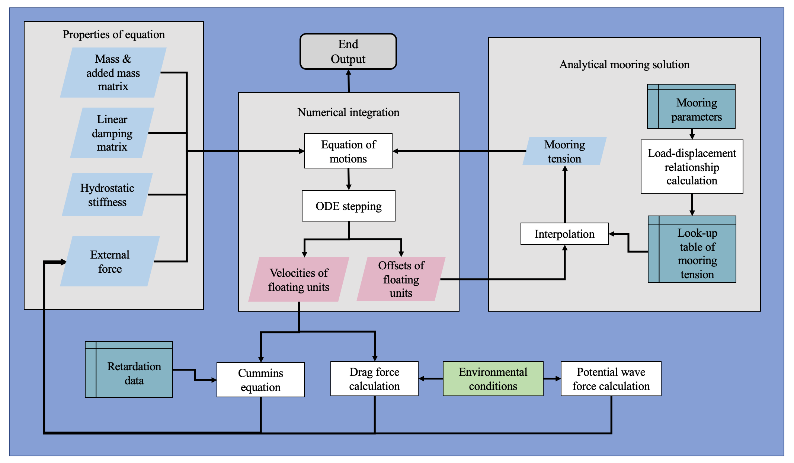
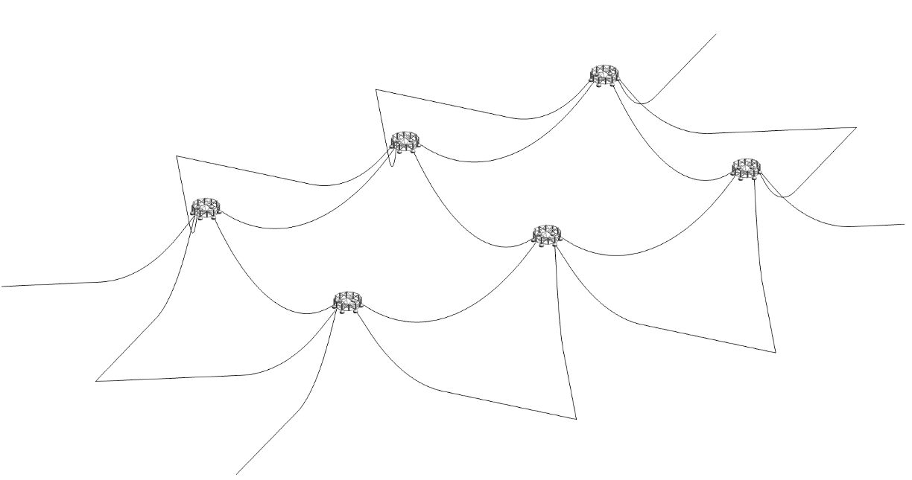

# OffarmPy

**Python implementation for time-domain simulation of offshore fish farm systems**

OffarmPy is a numerical simulation tool for analyzing the dynamic response of floating offshore aquaculture systems, including mooring lines, environmental loads (waves, currents), and structural dynamics. It provides a Python-native simulation environment.


The current configuration file in `usr0` is tested for user specific working path, the project inside is related to an academical concept--An array of semi-sub fish farming cages.


---

## Features

- **Mooring System Modeling**: Quasi-static catenary cable formulation with multi-segment support
- **Environmental Loads**: Wave (JONSWAP/PM spectrum) and current force calculations
- **Dynamic Simulation**: State-space time integration using scipy's `solve_ivp` (RK45)
- **Static Equilibrium**: Root-finding solvers for mooring pre-tension analysis
- **Modular Configuration**: JSON-based input files for environment, mooring, and simulation settings
- **Extensible Design**: DIY config hooks for runtime customization

---

## Installation

### Prerequisites

- Python 3.9 or higher

### Install from source (recommended for development)

```bash
# Clone the repository
git clone https://github.com/Hugo-build/offarm-py.git
cd offarm-py

# Install in development mode
pip install -e .

# Or with optional dependencies (tqdm, matplotlib)
pip install -e ".[full]"
```

### Install dependencies only (without package installation)

```bash
pip install -r requirements.txt
```

### Optional: Performance optimization

For faster execution with JIT compilation, install numba:

```bash
pip install numba
```

---

## Project Structure

```
offarm-py/
├── src/                      # Main package (offarm)
│   ├── __init__.py           # Package initialization and exports
│   ├── __main__.py           # CLI entry point (python -m offarm)
│   ├── cli.py                # Command-line interface
│   ├── Cable.py              # Cable/catenary mechanics
│   ├── Forces.py             # Environmental force calculators
│   ├── integrator.py         # ODE solvers and static equilibrium
│   ├── params.py             # Configuration dataclasses
│   └── Simu.py               # Main simulation runner
├── examples/
│   └── usr0/                 # Example workspace (6-cage fish farm)
│       ├── INPUT_manifest.json
│       ├── simu_config.json
│       ├── env_withoutVar.json
│       ├── sys6cage_DgEls_wT1st.json
│       ├── lineTypes_*.json
│       └── diy_configs.py
├── pyproject.toml            # Package configuration
├── requirements.txt
└── README.md
```

---

## Quick Start

### Running a simulation

```python
from pathlib import Path
from offarm import run_a_simulation

# Path to your workspace manifest
manifest_path = Path("examples/usr0/INPUT_manifest.json")

# Run simulation
results = run_a_simulation(
    manifest_path=manifest_path,
    case_id=1,
    info_string="Test case: 6-cage system with mooring and wave loads",
    results_dir="results",
    save_results=True,
    show_progress=True,
    plot_results=True,
    env_file="env_withoutVar.json",
)

# Access results
print(f"Success: {results.success}")
print(f"Max displacement: {results.max_displacement:.4f} m")
print(f"Elapsed time: {results.elapsed_time:.2f} s")
```

---

## Command Line Interface (CLI)

After installation, the `offarm` command is available from any directory:

### Basic Usage

```bash
# Run simulation from manifest file
offarm run path/to/INPUT_manifest.json

# Run from example workspace directory
cd examples/usr0
offarm run INPUT_manifest.json

# Or using Python module
python -m offarm run INPUT_manifest.json
```

### CLI Options

```bash
# Run with custom environment file
offarm run INPUT_manifest.json --env env_withoutVar.json

# Enable plotting
offarm run INPUT_manifest.json --plot

# Custom case ID and description
offarm run INPUT_manifest.json --case-id 1 --info "Test simulation"

# Save to custom output directory
offarm run INPUT_manifest.json --output-dir my_results

# Quick test run (no saving)
offarm run INPUT_manifest.json --no-save --no-progress

# Adjust solver tolerances
offarm run INPUT_manifest.json --rtol 1e-6 --atol 1e-10
```

### Other Commands

```bash
# Show manifest information
offarm info INPUT_manifest.json

# Initialize a new workspace with template files
offarm init my_workspace

# Show version
offarm --version

# Show help
offarm --help
offarm run --help
```

---

## Configuration Files

### INPUT_manifest.json

Master file that references all other configuration files:

```json
{
  "workspace_path": ".",
  "files": {
    "lineSys": "sys6cage_DgEls_wT1st.json",
    "lineType": "lineTypes_23-Feb-2025_12-25-34.json",
    "simu": "simu_config.json",
    "env": "env_withoutVar.json"
  }
}
```

### Environment (env_*.json)

Defines wave and current conditions:

```json
{
  "current": {
    "vel": [0.5, 0.3],
    "zlevel": [0, -50],
    "wakeRatio": 0.85,
    "propDir": 0
  },
  "wave": {
    "specType": "Jonswap",
    "Hs": 2.0,
    "Tp": 8.0,
    "gamma": 3.3,
    "propDir": 0,
    "dfreq": 0.01,
    "domega": 0.01
  }
}
```

### Simulation Config (simu_config.json)

Simulation parameters:

```json
{
  "simulator": "offarmLab",
  "static_simu": { "enabled": true },
  "dynamic_simu": {
    "enabled": true,
    "time_settings": {
      "tStart": 0,
      "tEnd": 600,
      "dt": 0.5
    }
  }
}
```

---

## DIY Configurations

Customize system properties at runtime by editing `diy_configs.py` in your workspace:

```python
def diy_configs(configs, offsys, line_types, env):
    """Modify configurations before simulation runs."""
    
    # Example: Update anchor positions
    offsys.anchorPos_init[:, 0] = [500, 0, -50]
    
    # Example: Change wave height
    # env.wave.Hs = 3.0
    
    return offsys, line_types, env
```

---

## Key Modules

### Cable.py

- `Cable` class: Multi-segment catenary cable with load-displacement relationships
- `Catenary()`: Core catenary equation solver
- `getTension()` / `getTension2ends()`: Tension interpolation from lookup tables

### Forces.py

- `DragForceNB_OT`: Combined current + wave drag force calculator
- `CurrentForceNB`: Steady current force on slender elements
- `QSmoorForce`: Quasi-static mooring restoring force

### integrator.py

- `solve_dynamics_fast()`: Fast ODE integration with progress tracking
- `solve_static()`: Static equilibrium solver

### params.py

- Dataclasses: `Env`, `Wave`, `Current`, `OffSys`, `FloatBody`, `ElSys`, `LineTypes`, `SimuConfig`
- Loader functions: `load_env_config()`, `load_line_types()`, `load_simu_config()`, etc.

---

## Outputs

Simulation results are saved to the `results/` directory:

| File | Description |
|------|-------------|
| `disp_*.npy` | Displacement time history (NumPy binary) |
| `vel_*.npy` | Velocity time history (NumPy binary) |
| `results_*.json` | Summary with statistics and metadata |
| `dynamic_response_*.png` | Surge displacement plots (if enabled) |

---

## Dependencies

| Package | Version | Purpose |
|---------|---------|---------|
| numpy | ≥1.24.0 | Array operations |
| scipy | ≥1.10.0 | ODE solvers, optimization |
| tqdm | ≥4.65.0 | Progress bars (optional) |
| matplotlib | ≥3.7.0 | Plotting (optional) |
| numba | ≥0.57.0 | JIT compilation (optional) |

---

## License

[MIT License](LICENSE).

---

## Acknowledgments

This Python implementation mirrors the MATLAB OffarmLab toolbox developed at the University of Stavanger (UiS) for offshore aquaculture research.

